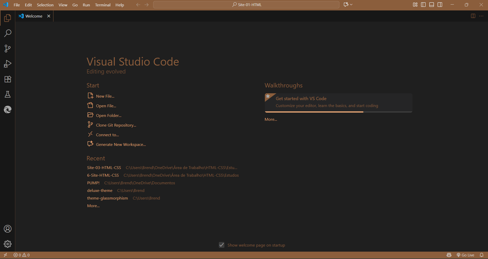
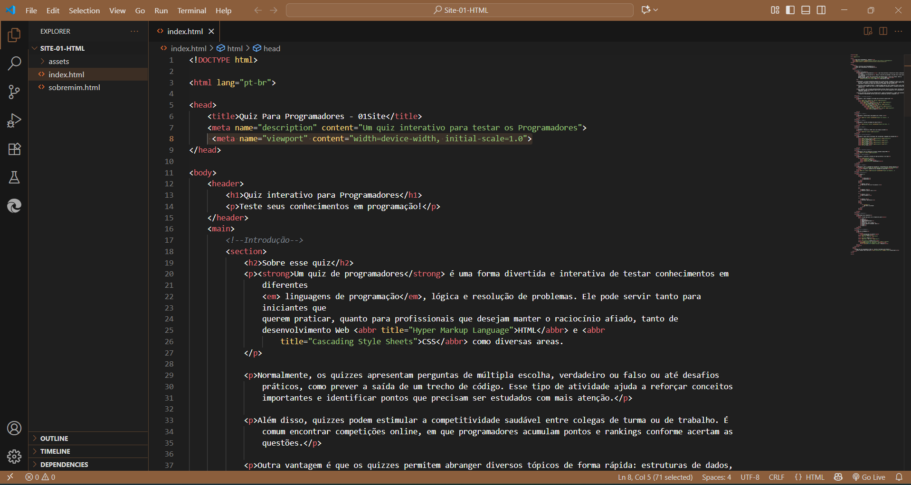

# 🎨 Deluxe Theme - VS Code

---

## 🌐 Sobre

O **Deluxe Theme** é um tema escuro minimalista e elegante para Visual Studio Code.  
Cores refinadas e interface limpa para quem gosta de um visual sofisticado e discreto.

---

## 🖼️ Capturas do Tema

---

---

## ⚙️ Como instalar

1. Faça o download do arquivo `.vsix` da extensão.
2. Abra o VS Code.
3. Vá para a aba **Extensões** (`Ctrl+Shift+X`).
4. Clique nos três pontinhos no canto superior direito → **Install from VSIX...**
5. Selecione o arquivo `.vsix` baixado.
6. Ative o tema: `Ctrl+Shift+P → Color Theme → Deluxe Theme`.

